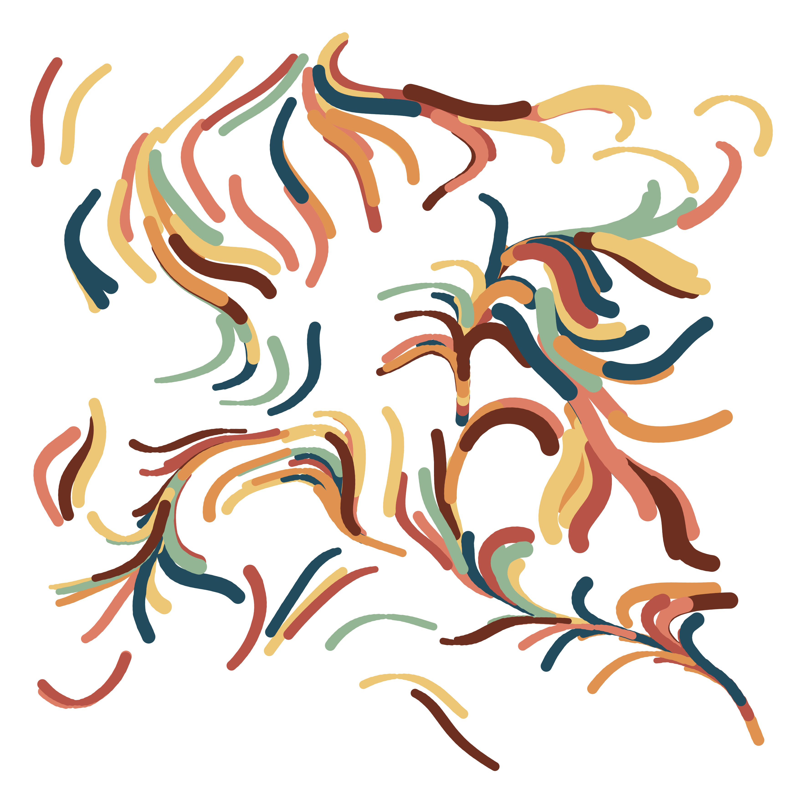

# Flow_Fields

Repository for making and testing out different types of flow fields. Some examples below, code for all outputs in [flow fields script](flow_field.R).

## Full flow fields

## Messing with parameters to make wave like flows

## Thinning out the flow field to it looks like paint strokes

## Making flow field gifs!

This one starts as a grid then *flows* away nicely

This one moves as a wave, and has a shadow 

