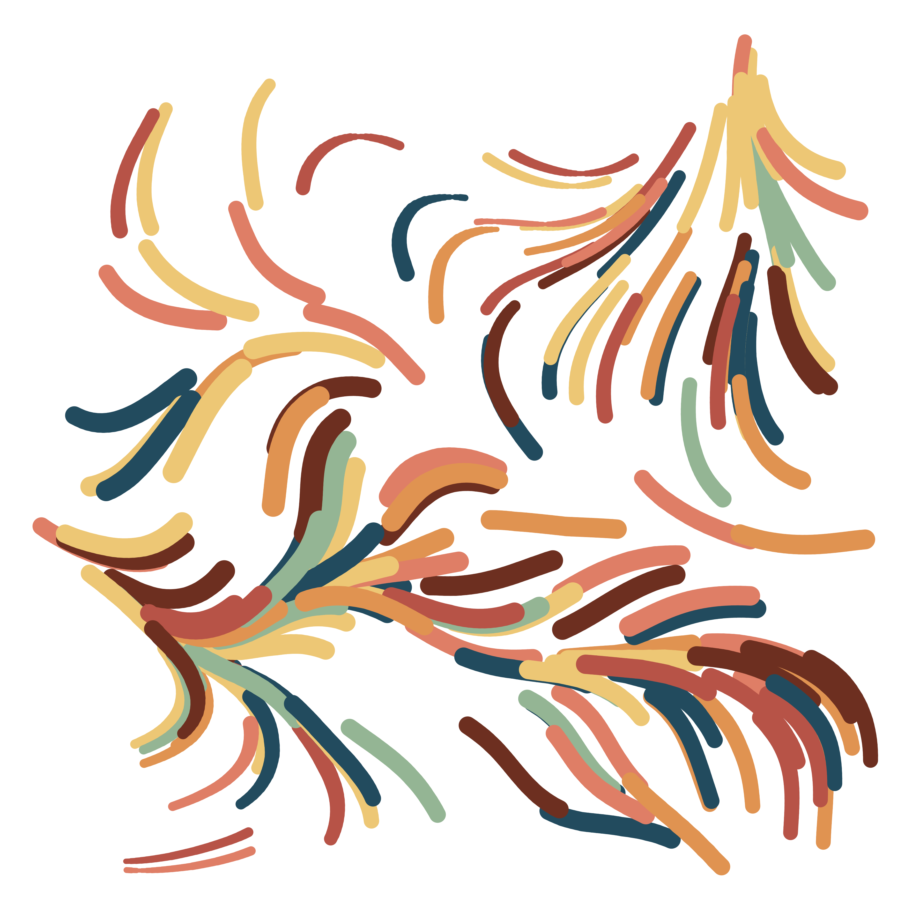
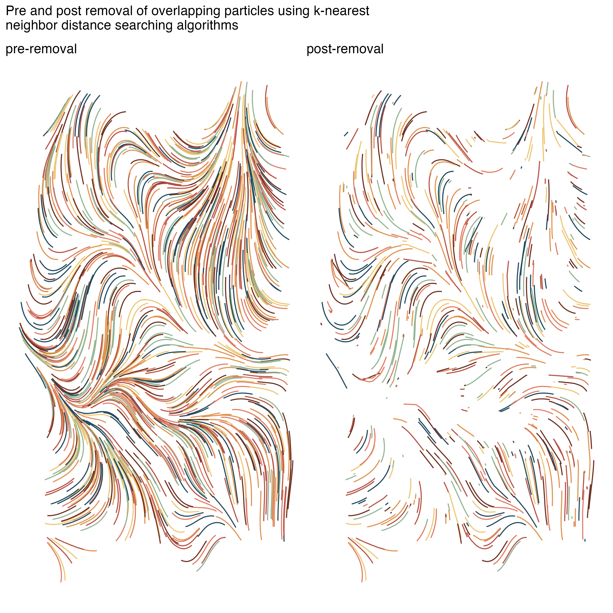

# Flow_Fields

Repository for making and testing out different types of flow fields. Some examples below, code for all outputs in [flow fields script](flow_field.R).

## Full flow fields

 
## Messing with parameters to make wave like flows

This one moves as a wave, and has a shadow 

## Thinning out the flow field to it looks like paint strokes

## Making flow field gifs!
This one starts as a grid then *flows* away nicely

## Removal of nearby lines
A fun technique is to remove any nearby lines/paths in the flow field. I've used knn for this, but I'm sure there are other ways of doing this! 

This technique looks best when it has an image added behind it. Here I've added an image of horseshoe bend in the USA I took back in 2019. 

